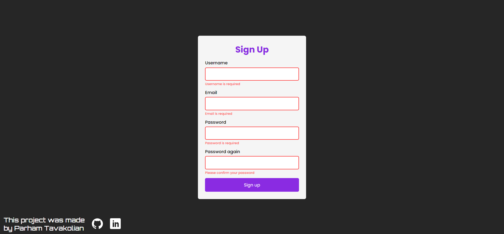

# JavaScript Form Validation

Implement a simple form validation on "submit" and "keyup" events. For this poject, I only use vanilla JS.

## Table of contents

- [Overview](#overview)
  - [Features](#the-challenge)
  - [Links](#links)

## Overview

### Screenshot

### Links

- Live on: [Codepen](https://codepen.io/frontendparham/pen/RwexBWw)